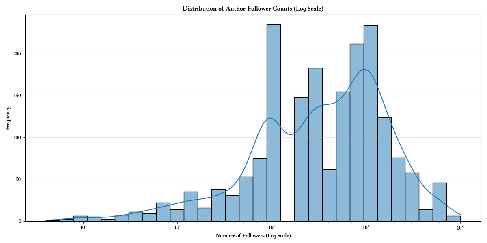
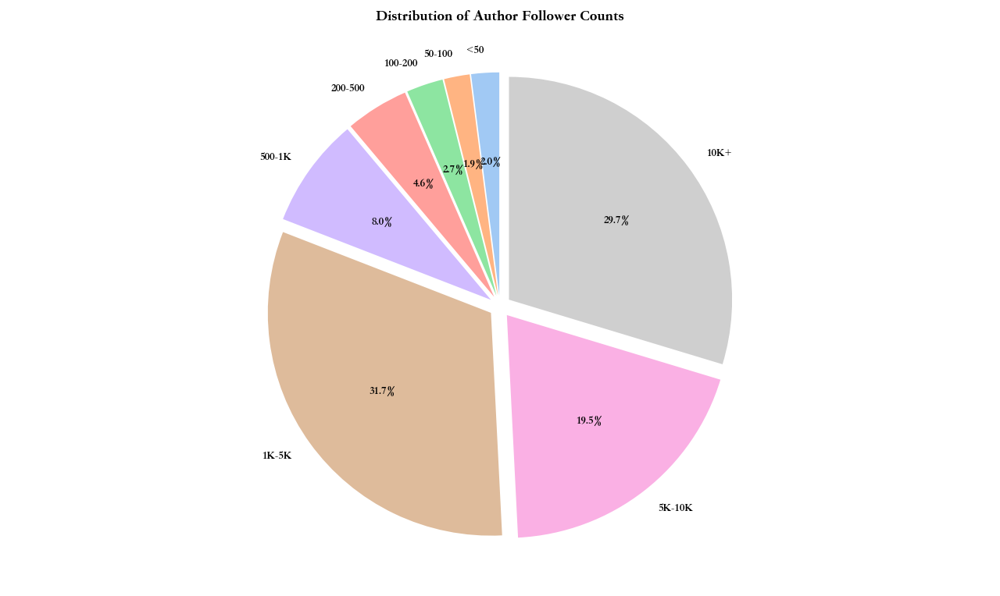
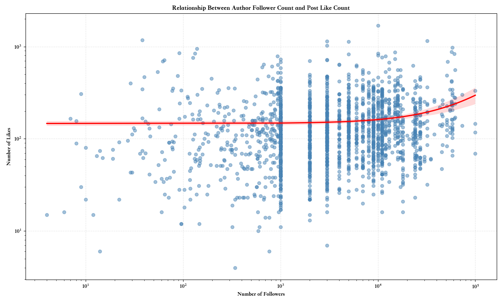
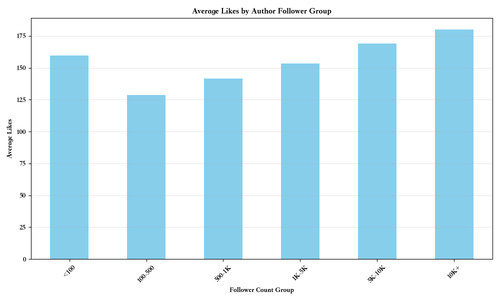
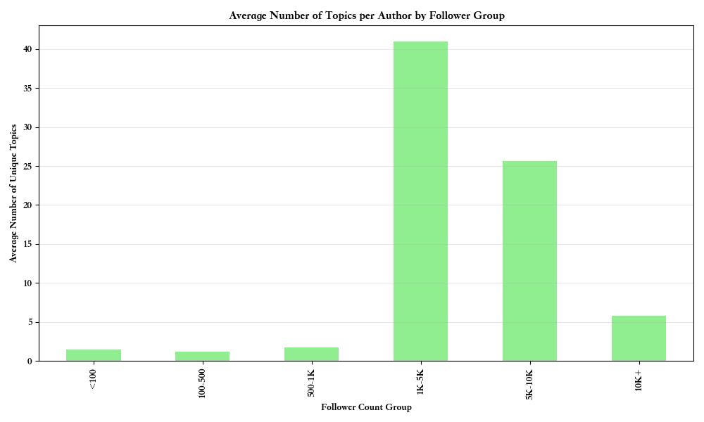
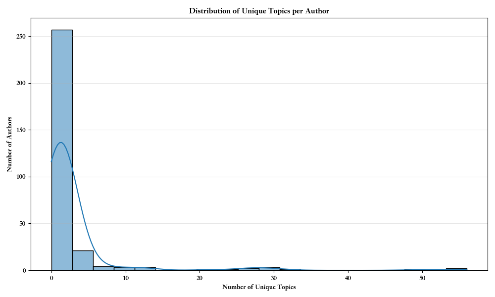
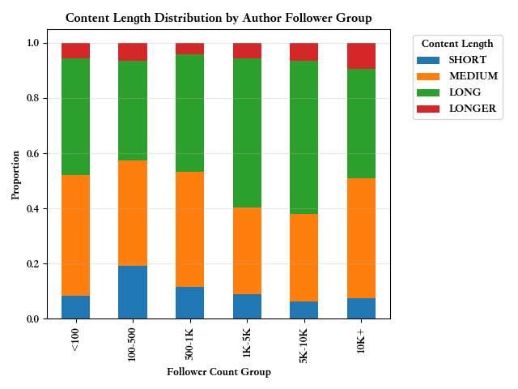
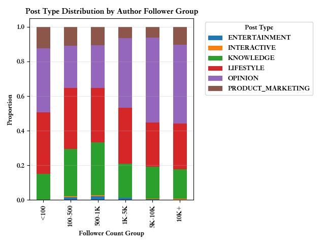
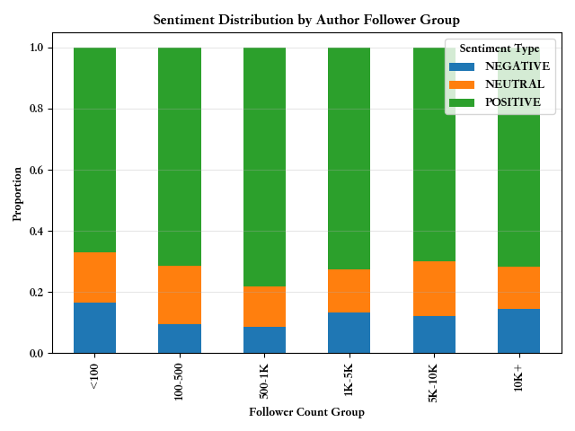

# 以即刻为例的社交媒体传播属性研究（2）：创作者的影响力

社交媒体已然是现代人生活中不可分割的一部分，尤其对于信息传播而言。AI 时代剧烈地放大了创作者的创作能力和影响力，因此越来越多的人开始非常有意识地运营自己的社交媒体，打造自己的”个人IP”，尝试第二条事业轨道。因此，对社交媒体传播属性的研究，理解其中的原理，对于运营自己的“个人IP”、网络运营和营销都十分有用。其次，自媒体不仅是个人影响力的发大器，也是现代网络生态中的重要构成，对其的研究也是对时代精神的一窥。

本研究选取的社交媒体是即刻，数据来源是最近一年多即刻镇小报中的 1880 篇用户动态文章。即刻镇小报是一个由即刻小编运营的，每天更新的产品，精选最近的用户动态文章，其本质是在分布式的信息传播网络中，官方塑造的非推荐式的中心化的传播渠道，其精选的文章能反应平台的价值取向和特质。以点带面，相信对即刻镇小报的研究，不仅能反应即刻的传播属性也能反应社交媒体的传播属性。

这一期聊聊创作者本身对于上精选的影响。先前置结论：
- **上精选的以大 v 为主，新人上精选的概率只有 2%**
- **即刻存在着大量内容质量不输大V 的新人**
- **粉丝量 1K, 10K 是影响力跃升的关键节点**
- **新人最好可以从1-2个擅长话题切入，当粉丝数上千以后跨领域创作是继续涨粉的关键**
- **新人文章长度控制在 200 到 500 字是最有性价比的，当粉丝量上千以后发布的长内容更容易被阅读**

## 作者粉丝数量分布

如下图所示，上精选的作者粉丝量呈现显著的“长尾效应”与“头部效应”：
- **长尾效应**：绝大多数作者（约 70.3%）的粉丝数集中在 1 万以下，特别是 1 千至 5 千这个区间占比最高 (31.7%)。
- **头部效应**：同时，也有相当一部分作者（29.7%）拥有超过 1 万的粉丝，形成了头部影响力群体，甚至有粉丝数 10 万的大 v。

对于即刻新人或不活跃的作者（粉丝小于 50），上精选的概率只有可怜的 2%，对于粉丝数小于 200 的作者，概率也只有 6.6%；对于粉丝数小于 500 的作者，概率也只有 11.2%；虽然很残酷，但符合我们对即刻的运营策略的认知，即刻分圈子给用户徽章来加强作者在该圈子的权重，这些权重会影响用户文章的曝光，而这会带来更多的点赞与粉丝数更容易上精选。

_洞见_：**大 V 统治流量是社交平台的典型特征**。对于平台运营而言，既要关注头部作者的维护，也要思考如何激活和扶持长尾作者的成长。**对于创作者而言突破 1k 和 1w 粉丝量是质变的节点。**

## 点赞数和粉丝量的关系

如下图所示，只要动态得到了精选曝光后，点赞数都挺多的，平均 150 个左右，点赞数和粉丝量不是线性相关，但 1 万以上粉丝量的创作者得到的点赞数明显还是更多。

_洞见_： **即刻广泛存在着许多内容质量高但粉丝量少的创作者，只要他们得到曝光，爆款点赞数和粉丝量巨大的大 v 差距不大**。

## 内容的多样性

如下图所示，对于大部分上精选的作者而言，动态所属圈子都局限在一两个。只有粉丝数大于 1k 后，圈子的数目开始显著变多，但当粉丝数大于 1 w后，选题的圈子数又突然降低回了 5 个左右。

_洞见_：**对于起号的创作者，基本都深耕单一领域，而对于 1k 以上的粉丝量作者而言，跨领域创作可能是继续涨粉的关键。对于 1w 粉丝量的大 v 而言应该都是领域相关专业人士，故话题最后收敛回自己熟悉领域**。

## 内容长度

如下图所示，当粉丝数大于 1k 之后，创作者更倾向于发布长内容（字数大于 500）。

_洞见_ ：**长内容可能是区分头部作者和普通作者的一个特征，头部作者可能更愿意投入精力创作深度、信息量更大的长内容，以巩固其专业形象和粉丝粘性。**

## 内容的类型

如下图所示，将动态的内容分为以下几类：
- KNOWLEDGE = auto()            # 知识类（技术教程、行业预测、工具测评）
- OPINION = auto()              # 观点类（时事评论、行业观察、书评）
- LIFESTYLE = auto()            # 生活类（成长感悟、随笔、旅行美食）
- ENTERTAINMENT = auto()        # 娱乐类（吐槽搞笑、迷因、段子）
- INTERACTIVE = auto()          # 互动类（投票、接龙挑战、测试）
- PRODUCT_MARKETING = auto()    # 产品营销类（产品介绍、营销活动）

**观点和生活方式是所有作者最主要的两类内容**。但随着粉丝数上千，观点类的内容占比显著变多。知识类内容在粉丝量 100-1K 的作者中占比较高（约 27%-30%），而在更高粉丝量级的作者中占比有所下降（约 17%-18%）。产品营销内容占比相对稳定，各层级差异不大。

_洞见_： **头部作者更倾向于输出观点，成为意见领袖，可能与其影响力建立和思想传播的需求有关；中腰部作者（100-1K）可能更侧重于知识分享来吸引早期粉丝；生活方式内容具有普适性，是各层级作者的基础内容**。

## 情绪倾向分析

如下图所示，几乎所有作者其发布内容都呈现欣欣向荣的积极倾向，普遍在 70% 左右。

_洞见_：即刻平台整体的内容氛围偏向积极、乐观，精选也以此为标准。

## 总结

对创作者的启发：
1. **影响力阶梯化明显**：作者影响力呈现金字塔结构，突破特定粉丝量级（如 1K, 10K）是影响力跃升的关键节点。
2. **初期专注 + 后期扩展：** 小V可以从1-2个擅长话题切入，稳定后逐步拓展内容覆盖范围。
3. **观点输出带来高价值关注：** 想要成为大V，需要提升内容的“思辨性”和“表达立场”的能力。
4. **中等长度内容最具性价比：** 长内容虽好，但耗时高；中等长度（200-500字）更易被接受且易分享。
5. **情绪表达要积极但真实：** 正能量为主，但也可以适度输出真实、引发共鸣的负面情绪（不抱怨、不鸡汤）。

对即刻平台运营的启发：
1. 优化中腰部作者成长机制：他们的内容质量不输大V，若能获得更多推荐，将丰富平台内容生态。
2. 鼓励观点输出和话题延伸：通过活动或话题激励机制，鼓励作者表达看法、提升讨论度。
3. 内容推荐机制需平衡“粉丝数”和“内容质量
