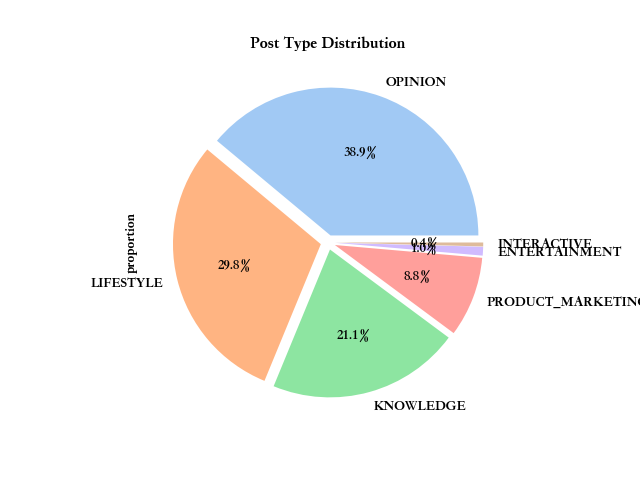
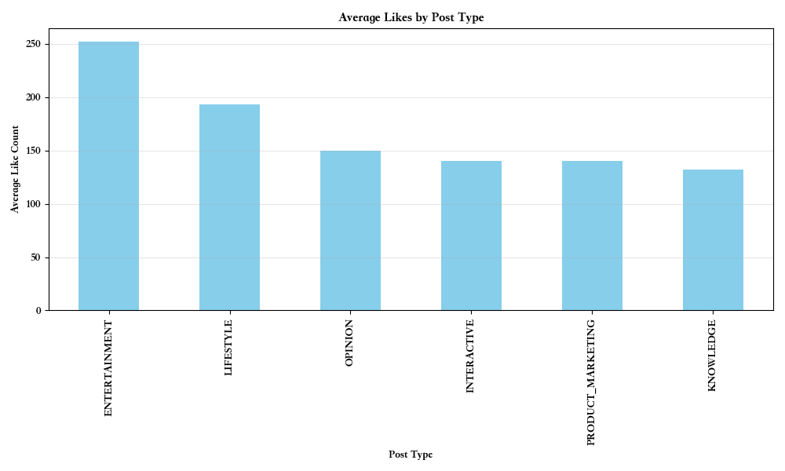
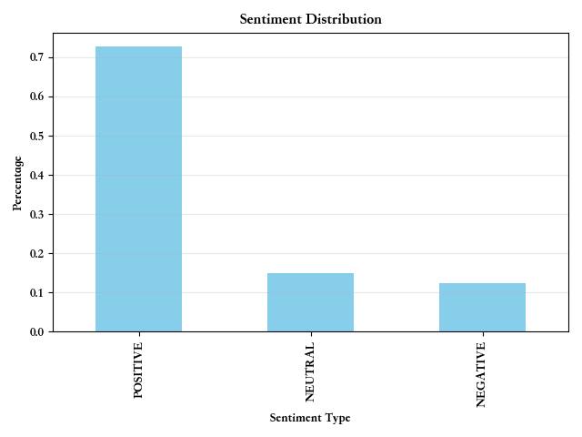
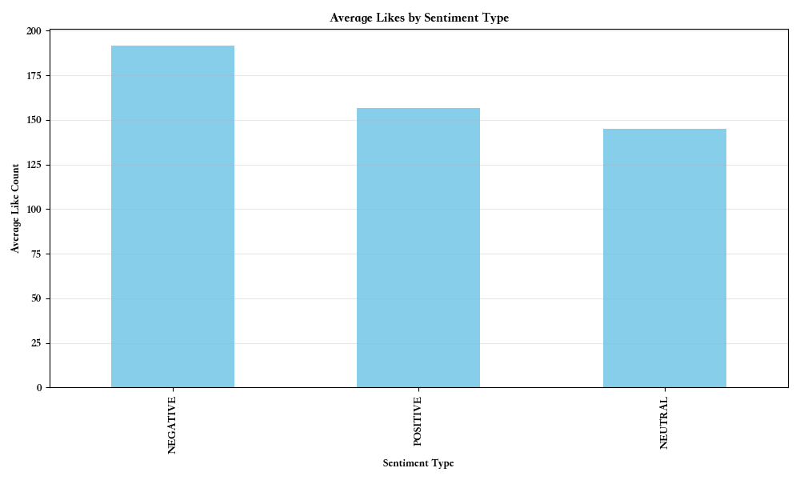
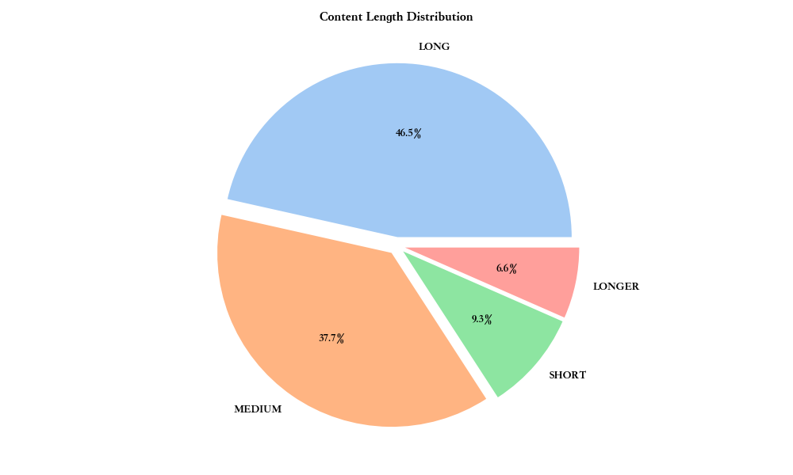
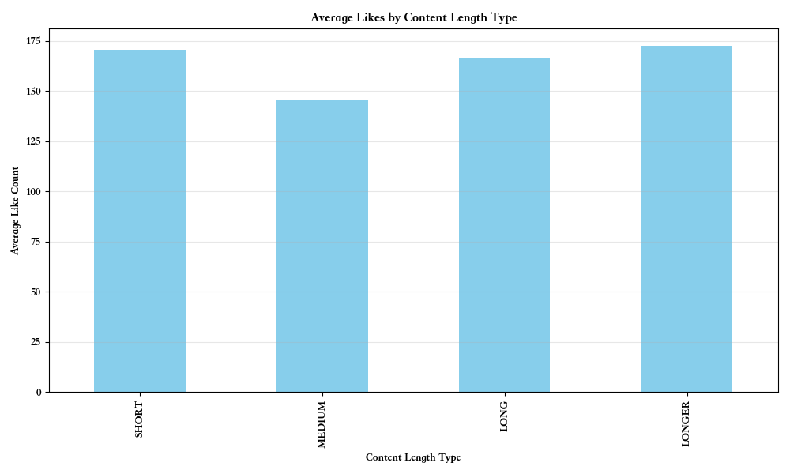
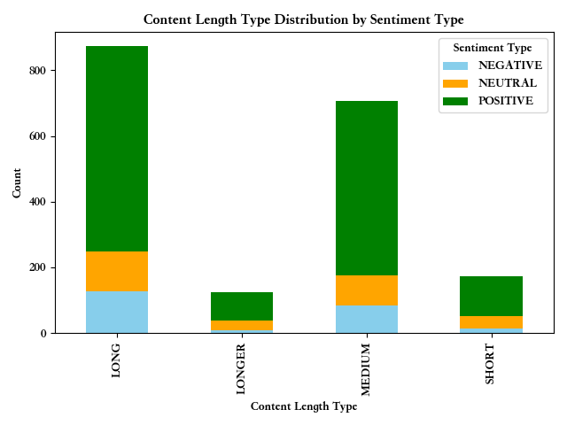
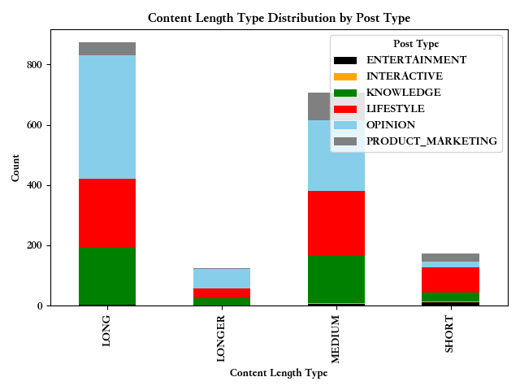

# 以即刻为例的社交媒体传播属性研究（3）：被偏爱的内容

社交媒体已然是现代人生活中不可分割的一部分，尤其对于信息传播而言。AI 时代剧烈地放大了创作者的创作能力和影响力，因此越来越多的人开始非常有意识地运营自己的社交媒体，打造自己的”个人IP”，尝试第二条事业轨道。因此，对社交媒体传播属性的研究，理解其中的原理，对于运营自己的“个人IP”、网络运营和营销都十分有用。其次，自媒体不仅是个人影响力的发大器，也是现代网络生态中的重要构成，对其的研究也是对时代精神的一窥。

本研究选取的社交媒体是即刻，数据来源是最近一年多即刻镇小报中的 1880 篇用户动态文章。即刻镇小报是一个由即刻小编运营的，每天更新的产品，精选最近的用户动态文章，其本质是在分布式的信息传播网络中，官方塑造的非推荐式的中心化的传播渠道，其精选的文章能反应平台的价值取向和特质。以点带面，相信对即刻镇小报的研究，不仅能反应即刻的传播属性也能反应社交媒体的传播属性。

之前已经聊了圈子、作者等元素，这期聊聊内容本身对于上精选的影响。先前置结论：
- **主题：偏爱个人成长（效率提升、职业发展、创业）和科技内容（AI）**
- **热点：如果是观点类或知识类的分享，尽量追热点，但如果是生活类的分享，则不用追热点**
- **创意：不用注重内容的独特性和创意，这不是社交媒体的核心**
- **内容类型：以生活方式分享和观点表达为主流，生活分享最收好评**
- **情感偏向：以积极的内容为主，尽管消极的内容能得到更多的赞**
- **内容长度：以 100 字到 1000 字内容最为常见，但小于 100 字或大于 1000 字的动态平均点赞数反而更多**

具体分析如下，enjoy:

## 内容主题
统计 1880 篇精选的内容主题如下：

> [('个人成长', 66), ('AI', 53), ('创业', 44), ('人际关系', 43), ('效率', 36), ('自我提升', 32), ('成长', 32), ('时间管理', 31), ('学习方法', 30), ('商业模式', 29), ('内容创作', 27), ('自我认知', 26), ('知识管理', 25), ('职场', 22), ('职业发展', 21), ('效率提升', 21), ('AI工具', 19), ('情绪管理', 19), ('效率工具', 18), ('健康', 18), ('小红书', 17), ('学习', 17), ('阅读', 17), ('思考', 16), ('SEO', 16), ('认知', 16), ('社交', 16), ('副业', 15), ('独立开发者', 15), ('自媒体', 15), ('价值观', 14), ('决策', 14), ('行动', 14), ('产品经理', 14), ('用户体验', 14), ('工作流', 14), ('写作', 13), ('生活', 13), ('行动力', 13), ('ChatGPT', 13)]

不难发现，“个人成长”及其衍生标签（自我提升、成长、自我认知、情绪管理、价值观）构成了最强大的内容集群。这表明即刻用户普遍追求自我完善和内在探索。其次是“AI”及其相关（AI工具、大模型、ChatGPT），显示了对前沿科技的高度关注。“效率”相关标签（时间管理、效率提升、效率工具、知识管理、学习方法）和“职业/商业”相关标签（创业、商业模式、职场、职业发展、副业、自媒体）也极其重要。

这表明了**上精选的内容需要有明确的价值**，无论是提升技能、开阔眼界还是解决问题。内容需聚焦于提供明确的价值点。**建议在内容创作的过程中结合个人经历、叙事来进行知识类或工具类分享**。

## 文章类型
将文章内容分为以下类型：
1. 知识类（技术教程、行业预测、工具测评）
2. 观点类（时事评论、行业观察、书评）
3. 生活类（成长感悟、随笔、旅行美食）
4. 娱乐类（吐槽搞笑、迷因、段子）
5. 互动类（投票、接龙挑战、测试）
6. 产品营销类（产品介绍、营销活动）

如下图所示，生活类（30%）和观点类（39%）内容为主流，占据了近 70% 的内容，说明内容偏好真实的个人思考、生活分享。

与上面观察形成反差的如下图所示，娱乐类内容虽然占比少，但平均点赞量最高，明显高于其他类别，点赞量紧接其后的是生活类内容。

从上面两个数据分析可以得到一个显著的结论，在内容分享需要加入个人、生活化叙事，单纯的知识干活需要包装避免过于枯燥。

## 热点
从下图看，70.89%的动态属于热点，29.11%为非热点，这是符合我们直觉的，高流量的动态是热点动态。但不那么符合直觉的是，热点动态和非热点动态的点赞数是差不多的，这可能说明点赞的行为更和动态质量、身份认同或者情感等其他因素相关和热点与否并不相关。
![[content_pic/hotspot_distribution.png]]
![[content_pic/hotspot_average_like.png]]
从下图可以看出，对于动态的类型，对于热点动态来说，是意见类(49.7%)占比最高，其次是知识类(21.7%)，明显高于非热点动态中的意见类(15.5%)和知识类(14.2%)占比。对于非热点动态来说，生活类分享是占比最多的(57.8%)。**这告诉我们热点话题更容易引发观点讨论和知识分享，而非热点集中在日常分享上。反过来说，如果是做观点和知识的分享则需要追逐热点，而做日常生活的分享则可以岁月静好，不需要追逐热点**。
![[content_pic/posttype_hotspot.png]]
从下图可以看出，热点动态中的负面情绪占比明显要比非热点动态中的负面情绪多。(19.4% VS. 5.0%)。这也许说明对于热点来说，对负面情绪更包容，因为从整体来看，积极情绪始终还是占主流。
![[content_pic/sentiment_hotspot.png]]
## 创意内容
创意内容指的是指具有独特性、新颖性、创新性的内容，是相对于常识来说有信息增量的内容或者表达方式新颖的内容。

从下图来看，创意内容只占比 38.5%，非创意内容占比 61.5%。在点赞数上，创意内容和非创意内容并没有差异。以上说明创意内容无论对于动态的曝光还是点赞影响都没有那么大，这稍微有点违反直觉，直觉是创意内容也许在社交媒体的传播中有优势。创意内容占比低的一个原因可能是创意生产者只占整个用户中少部分。
![[content_pic/creative_distribution.png]]![[content_pic/like_num_creative.png]]
此外，有三个观察颇有意思：
1. 在创意内容中，产品营销的内容要明显高于非创意内容中产品营销内容(12.7% VS. 7.3%)
2. 在创意内容中，娱乐类的内容要明显高于非创意内容中娱乐类内容（2.8% VS. 0.6%）
3. 创意内容中表达的积极情感明显高于非创意内容（79.8% VS. 63.8%）
![[content_pic/posttype_creative.png]]
![[content_pic/sentiment_creative.png]]
这些观察说明创意内容有通过资本赋能，以广告的方式展现出来；段子手还是需要点创造力的；在创意表达的过程中，更容易与积极情感结构，可能是为了让人产生良好的体验以购买产品。
## 情感偏向
如下图所示，积极情感在所有内容中占据主流（73%），但令人意外的是消极情感的平均点赞率明显高于其他类别（192）。**这说明即刻社区在鼓励积极向上的内容，这符合科技社区的共性，但消极的情感暴露更能引起人们的共鸣。这也指引着我们在内容创作的过程中需要投入情感，中立的干货难以打动人心**。

## 内容长度
如下图所示，中长内容（中：100 到 500 字，长：500 到 2000 字）为主流（84.2%）

各内容长度的平均点赞率，如下图所示，整体差距不大，中等长度内容表现最差。

各内容长度下，情感分布如下图所示，整体的情感趋势并没有因为长度的不同而发生太多变化，依然是以积极情感为主。

各内容长度下，文章类型的分布如下图所示：在长和超长内容长度下，观点类占比明显最高，高于生活类；但在中长度下，观点类和生活类平分秋色；在短长度下，生活类占比最高，明显高于其他类别。

综上，长度也许并不重要，重要的是价值密度：”信息密度“或”情感密度“

## 综合建议
- **精准定位，深耕主题:** 明确你的账号定位，是专注 AI 工具，还是个人成长方法论，或是职场经验分享。围绕核心主题持续输出高质量内容。参考热门标签和圈子，找到你的目标受众聚集地。
- **融入个人叙事** ：生活类或意见类内容最受欢迎，即使是分享干货，也要融入个人经验、故事。把一切当成将故事。
- **内容注入情感:** 主打积极内容，传递价值和正能量。适时、真诚地分享负面经历或反思（如遇到的困难、踩过的坑），可能带来意想不到的高互动。给内容注入情感，避免过于中立干货。
- **优化内容长度策略:** 尝试用精悍的短内容抓住碎片化注意力，也敢于创作超长深度内容建立专业壁垒。对于中长内容，确保信息密度和阅读体验。
- **紧跟热点** 关注平台和行业动态，思考结合点。不用担心自己的表达不具备创意和独特性，这对于社交媒体来说不是核心。
