# 以即刻为例的社交媒体传播属性研究

社交媒体已然是现代人生活中不可分割的一部分，尤其对于信息传播而言。AI 时代剧烈地放大了创作者的创作能力和影响力，因此越来越多的人开始非常有意识地运营自己的社交媒体，打造自己的”个人IP”，尝试第二条事业轨道。因此，对社交媒体传播属性的研究，理解其中的原理，对于运营自己的“个人IP”、网络运营和营销都十分有用。其次，自媒体不仅是个人影响力的发大器，也是现代网络生态中的重要构成，对其的研究也是对时代精神的一窥。

本研究选取的社交媒体是即刻，数据来源是最近一年多即刻镇小报中的 1880 篇用户动态文章。即刻镇小报是一个由即刻小编运营的，每天更新的产品，精选最近的用户动态文章，其本质是在分布式的信息传播网络中，官方塑造的非推荐式的中心化的传播渠道，其精选的文章能反应平台的价值取向和特质。以点带面，相信对即刻镇小报的研究，不仅能反应即刻的传播属性也能反应社交媒体的传播属性。

本研究从三个维度展开，圈子、作者和内容。圈子指的是即刻用户分享动态，可以将动态发到一个特定的圈子里，用户也可以指定圈子来看相应的动态，有点类似 bbs 的板块功能，起到信息分类、聚合的作用。作者就是创作动态的用户，即刻对用户的权重并不相等，不仅是粉丝数量上的差异，还通过徽章等功能区分用户的权重。内容指的是对用户动态文本上的分析，图片分析暂时不表。

---
## 圈子
### 数据分析
#### 最收欢迎的圈子
1. 统计上即刻镇小报的用户动态的圈子来源，取出现频率前十个圈子，得下图：
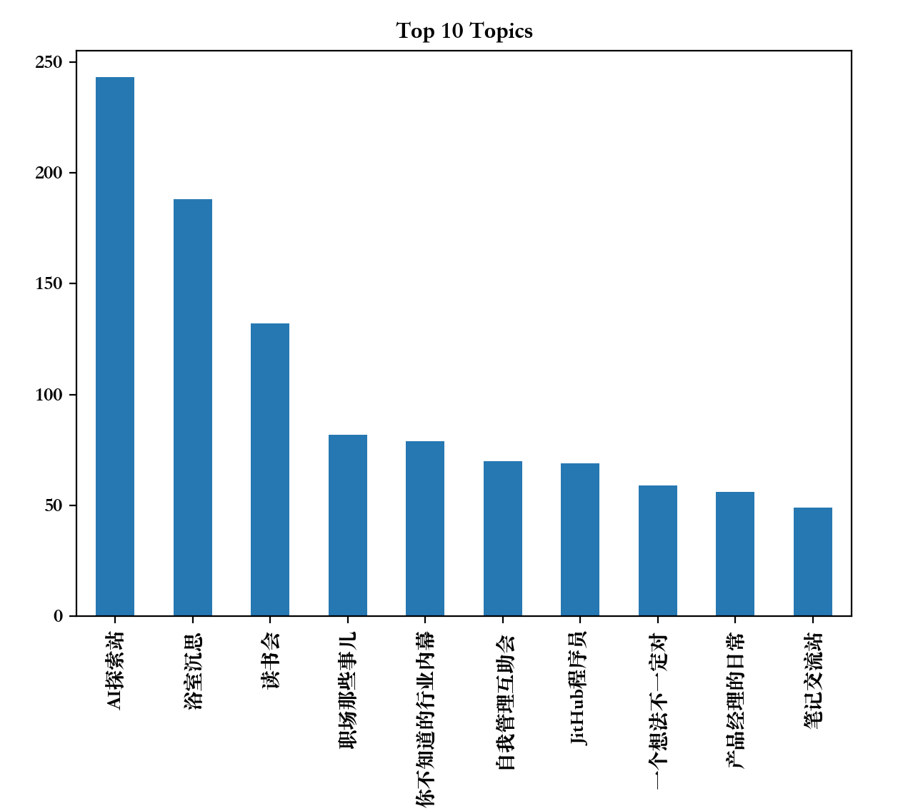
由图可知**即刻的圈子呈现了极强的两极分化情况，前三个圈子（AI探索站、浴室沉思、读书会）上精选的文章明显高于其他圈子**，其中又以AI探索站以243篇文章高居榜首，远高于第二名的浴室沉思（188篇）（热门圈子数据见图一）。Web3（2篇）、元宇宙（虚拟与混合现实小组，5篇）等前沿话题表现平庸，**说明AI是当前科技领域的唯一超级热点。**

**洞见：即刻的用户具有”高知“、”年轻“和”科技导向“的特征，科技与生活是即刻的两大面，精选动态实用主义明显，需要带来实质价值的内容。** **热点圈子虽然流量大，但竞争强，素人初期在热点圈子里起号反而不容易**。垂直圈子例如（JitHub程序员、产品经理、职场那些事儿）流量虽稍小，但竞争没有那么强，反而由于其垂直性更容易初期起号，获得关注。

2. 统计上即刻镇小报用户动态里各圈子的平均点赞数，探索各圈子收欢迎程度，得下图：
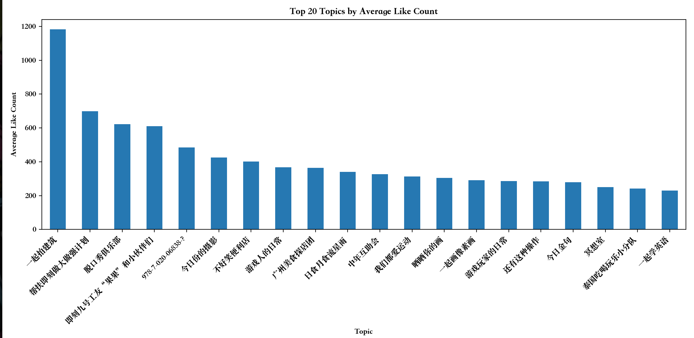
观察发现，在长尾圈子中摄影类（一起拍建筑、今日份的摄影）、体验类（广州美食探店团、泰国吃喝玩乐）、兴趣类（游戏人的日常、一起画像素画）、情感共鸣类（中年互助会、不好笑便利店）虽然流量很小，但有概率出爆款、获得超高赞，远高于三大热门圈子（AI探索站、浴室沉思、读书会），**论证了超高赞来源于审美驱动和身份认同**。

#### 圈子的话题分布
利用 AI 对每篇动态生成 tag，对不同圈子的动态进行 tag 统计，展示部分数据如下图，发现相同 tag 常出现在不同的圈子，**AI 与个人成长 tag 贯穿大部分圈子是即刻平台的双主线**
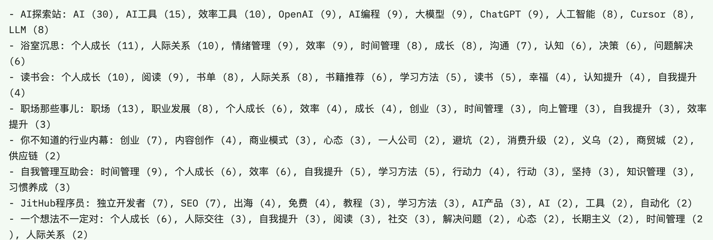

#### 圈子内用户动态文章类型分布
统计上即刻镇小报的用户动态的圈子来源，取出现频率前二十个圈子中的文章内容类型，如下图：
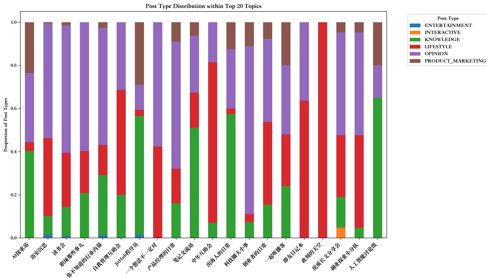

文章内容类型有以下几种：娱乐类、交互类、知识类、生活分享类、意见类、产品营销类。
从上图来看，观点类动态占大多数，在80%的圈子中占比超过30%，浴室沉思（53.2%）、读书会（59.1%）、职场那些事儿（59.8%）等头部圈子尤为突出。知识类动态在技术型圈子高度集中：AI探索站（40.3%）、JitHub程序员（55.1%）、人工智能讨论组（65%），娱乐类动态难上精选。生活类动态在中年互助会（74.4%）、即友日记本（63.6%）超高占比，但科技类圈子普遍低于5%，**反映了严格的"场景隔离"意识：在工作/学习场景拒绝生活化内容。此外对于产品营销类动态，技术圈接受度高：JitHub程序员（29%）、AI探索站（23%）；人文圈极度排斥：浴室沉思（0.5%）、读书会（1.5%）**。

#### 圈子内用户动态文章长度分布
统计上即刻镇小报的用户动态的圈子来源，取出现频率前二十个圈子中的文章长度类型，如下图：
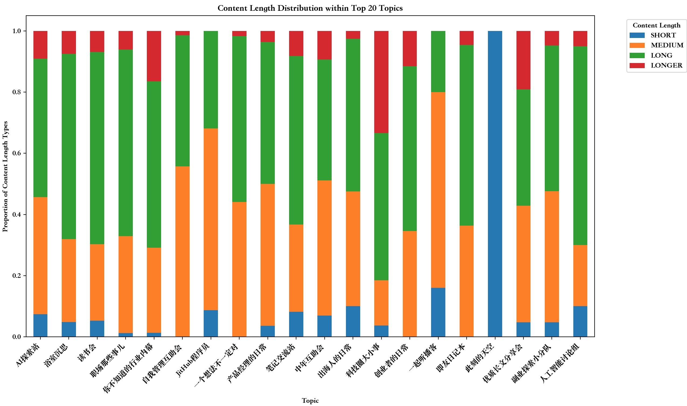
文章长度类型有以下几种：SHORT（100 字以下）、MEDIUM（100 字到 500 字）、LONG（500 字到 2000 字）和LONGER（2000 字以上）。
从上图来看，**中长内容（100到2000字）占主导**，中篇内容（100到500字）聚集在自我管理互助会、JitHub程序员圈子；长篇内容（500到2000字）聚集在AI探索站、人工智能讨论组、浴室沉思、读书会；超长篇内容(2000字以上)聚集在科技圈大小事（33.3%）、行业内幕（16.5%）、创业者日常（11.5%）。

#### 圈子内用户情感分布
统计上即刻镇小报的用户动态的圈子来源，取出现频率前二十个圈子中的情感类型，如下图：

情感类型有：积极(POSITIVE)、中立(NEUTRAL)和消极(NEGATIVE)。
如上图所示，整个即刻呈现乐观的倾向，最积极：自我管理互助会（88.6%正向）vs 最消极：即友日记本（31.8%负向）。**技术类圈子天然乐观，乐观率超 80%，职场类圈子负能量稍高，职场那些事儿(22%)、行业内幕(19%)**。

### 结论
- 即刻的用户具有”高知“、”年轻“和”科技导向“的特征，科技与生活是即刻的两大面
- 精选动态实用主义明显，需要带来实质价值的内容
- 热点圈子虽然流量大，但竞争强，素人初期在热点圈子里起号反而不容易
- 超高赞来源于审美驱动和身份认同
- 圈子的”场景隔离“意识：在工作/学习场景拒绝生活化内容
- 在即刻中长内容（100到2000字）占主导
- 技术类、自我管理类圈子天然乐观，乐观率超 80%；职场类、日记类圈子负能量较高

起号建议：
- **先聚焦在有身份认同，稍小众或垂直的圈子里，用 100 到 2000 字创作积极表达的意见态度或知识内容，个人介绍带有 AI 和自我成长标签。**

---
## 作者
### 数据分析
#### 作者粉丝数量分布
统计上即刻镇小报用户的粉丝图，分别画柱状图和饼状图，如图所示，上精选的作者粉丝量呈现显著的“长尾效应”与“头部效应”：
- **长尾效应**：绝大多数作者（约 70.3%）的粉丝数集中在 1 万以下，特别是 1 千至 5 千这个区间占比最高 (31.7%)。
- **头部效应**：同时，也有相当一部分作者（29.7%）拥有超过 1 万的粉丝，形成了头部影响力群体，甚至有粉丝数 10 万的大 v。

对于即刻新人或不活跃的作者（粉丝小于 50），上精选的概率只有可怜的 2%，对于粉丝数小于 200 的作者，概率也只有 6.6%；对于粉丝数小于 500 的作者，概率也只有 11.2%；虽然很残酷，但符合我们对即刻的运营策略的认知，即刻分圈子给用户徽章来加强作者在该圈子的权重，这些权重会影响用户文章的曝光，而这会带来更多的点赞与粉丝数更容易上精选。

_洞见_：**大 V 统治流量是社交平台的典型特征**。对于平台运营而言，既要关注头部作者的维护，也要思考如何激活和扶持长尾作者的成长。**对于创作者而言突破 1k 和 1w 粉丝量是质变的节点。**
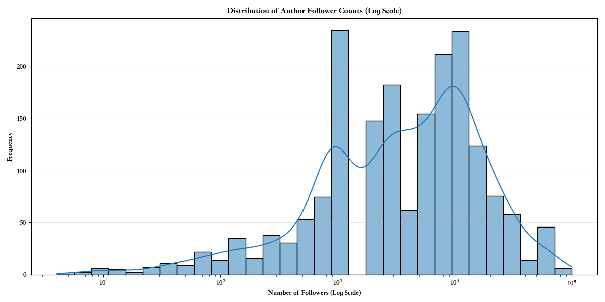
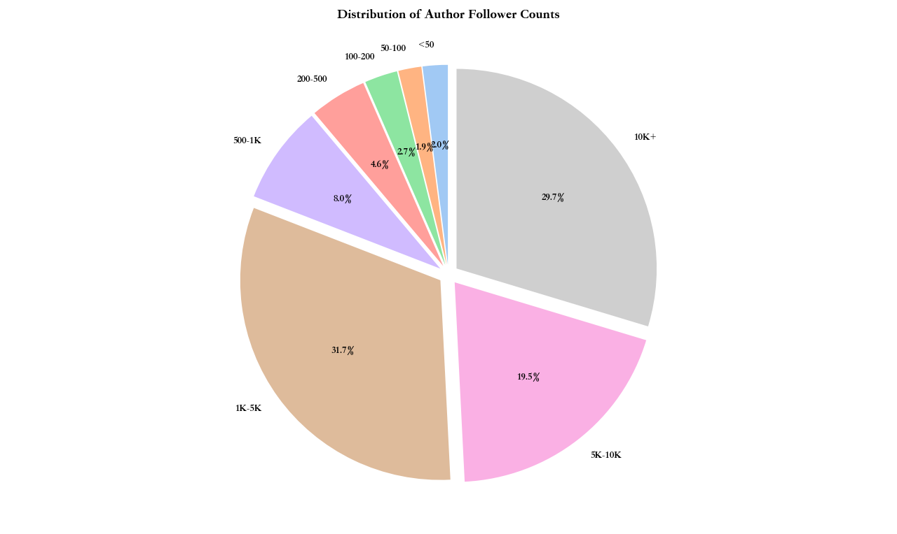
#### 点赞数和作者粉丝量的关系
统计即刻镇小报上用户动态的作者粉丝量和对应的点赞数，绘制散点图。
统计即刻镇小报上作者的粉丝量和对应平均每篇动态得到的点赞数，绘制柱状图。
如下图所示，只要动态得到了精选曝光后，点赞数都挺多的，平均 150 个左右，点赞数和粉丝量不是线性相关，但 1 万以上粉丝量的创作者得到的点赞数明显还是更多。

_洞见_： **即刻广泛存在着许多内容质量高但粉丝量少的创作者，只要他们得到曝光，爆款点赞数和粉丝量巨大的大 v 差距不大**。

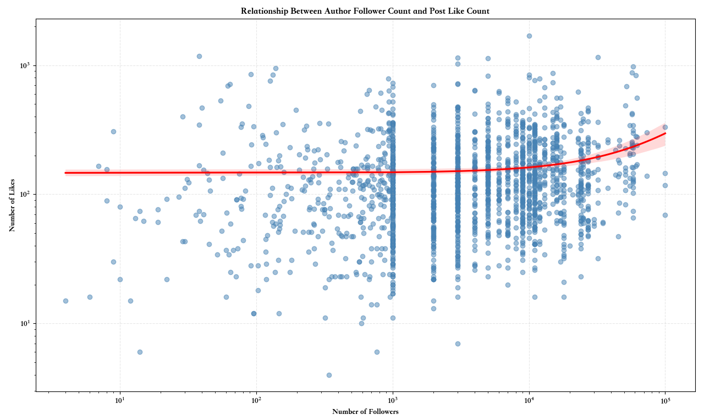
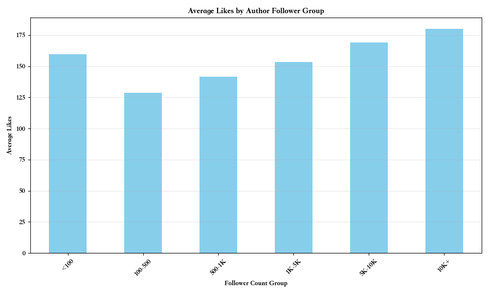

#### 作者内容的多样性
对上即刻镇小报的用户以粉丝数分类，统计不同粉丝量级下的其动态圈子来源平均数，绘制柱状图。
对上即刻镇小报的用户，统计用户上精选的动态涉及到的圈子的平均数，绘制柱状图。
如下图所示，对于大部分上精选的作者而言，动态所属圈子都局限在一两个。只有粉丝数大于 1k 后，圈子的数目开始显著变多，但当粉丝数大于 1 w后，选题的圈子数又突然降低回了 5 个左右。

_洞见_：**对于起号的创作者，基本都深耕单一领域，而对于 1k 以上的粉丝量作者而言，跨领域创作可能是继续涨粉的关键。对于 1w 粉丝量的大 v 而言应该都是领域相关专业人士，故话题最后收敛回自己熟悉领域**。
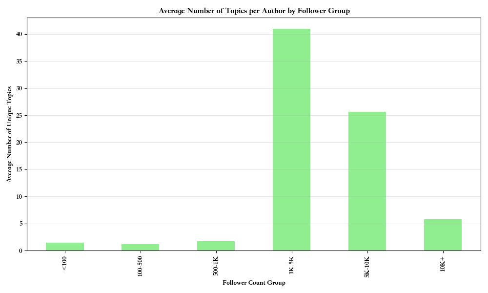
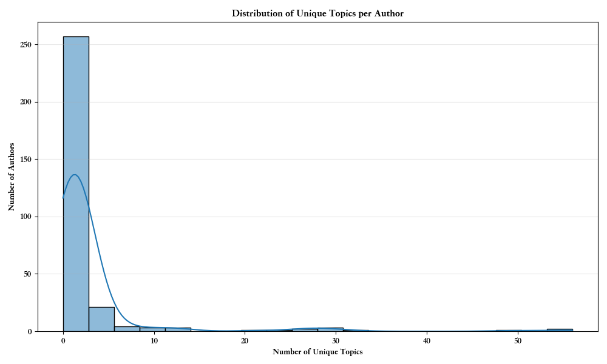
#### 作者的内容长度多样性
对上即刻镇小报的用户以粉丝数分类，统计不同粉丝量级下的动态文章的长度，绘制柱状图。
长度的定义上文以述，如下图所示，当粉丝数大于 1k 之后，创作者更倾向于发布长内容（字数大于 500）。

_洞见_ ：**长内容可能是区分头部作者和普通作者的一个特征，头部作者可能更愿意投入精力创作深度、信息量更大的长内容，以巩固其专业形象和粉丝粘性。**
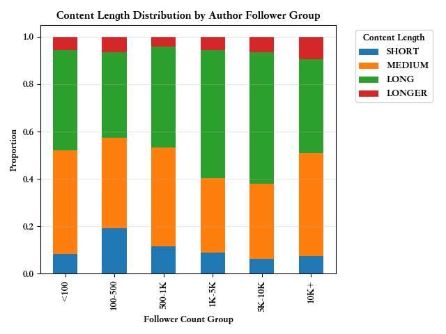
#### 作者的内容类型多样性
对上即刻镇小报的用户以粉丝数分类，统计不同粉丝量级下的动态文章类型的分布，绘制下图。动态文章类型的定义，上文已述。

如下图所示，**观点和生活方式是所有作者最主要的两类内容**。但随着粉丝数上千，观点类的内容占比显著变多。知识类内容在粉丝量 100-1K 的作者中占比较高（约 27%-30%），而在更高粉丝量级的作者中占比有所下降（约 17%-18%）。产品营销内容占比相对稳定，各层级差异不大。

_洞见_： **头部作者更倾向于输出观点，成为意见领袖，可能与其影响力建立和思想传播的需求有关；中腰部作者（100-1K）可能更侧重于知识分享来吸引早期粉丝；生活方式内容具有普适性，是各层级作者的基础内容**。
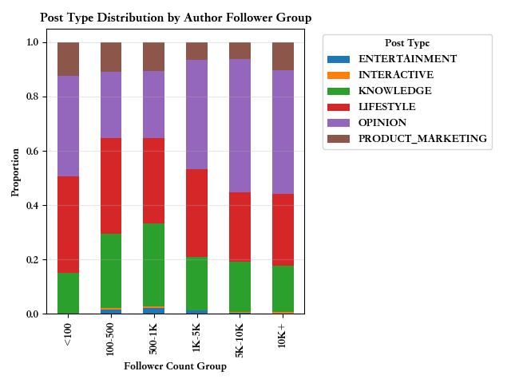
#### 作者的情感倾向
对上即刻镇小报的用户以粉丝数分类，统计不同粉丝量级下的动态情感倾向的分布，绘制下图。动态情感倾向类型的定义，上文已述。

如下图所示，几乎所有作者其发布内容都呈现欣欣向荣的积极倾向，普遍在 70% 左右。

_洞见_：即刻平台整体的内容氛围偏向积极、乐观，精选也以此为标准。
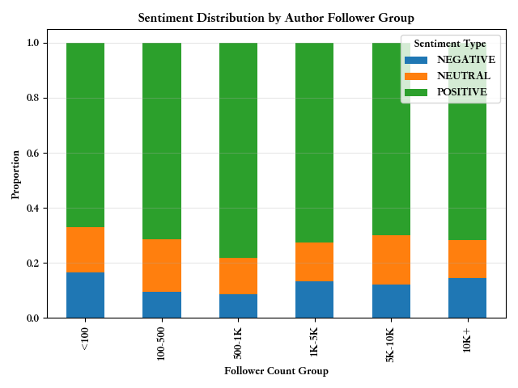

### 结论
- **上即刻镇小报的以大 v 为主，新人上精选的概率只有 2%**
- **即刻存在着大量内容质量不输大V 的新人**
- **粉丝量 1K, 10K 是影响力跃升的关键节点**
- **新人最好可以从1-2个擅长话题切入，当粉丝数上千以后跨领域创作是继续涨粉的关键**
- **新人文章长度控制在 200 到 500 字是最有性价比的，当粉丝量上千以后发布的长内容更容易被阅读**

对创作者的启发：
1. **影响力阶梯化明显**：作者影响力呈现金字塔结构，突破特定粉丝量级（如 1K, 10K）是影响力跃升的关键节点。
2. **初期专注 + 后期扩展：** 小V可以从1-2个擅长话题切入，稳定后逐步拓展内容覆盖范围。
3. **观点输出带来高价值关注：** 想要成为大V，需要提升内容的“思辨性”和“表达立场”的能力。
4. **中等长度内容最具性价比：** 长内容虽好，但耗时高；中等长度（200-500字）更易被接受且易分享。
5. **情绪表达要积极但真实：** 正能量为主，但也可以适度输出真实、引发共鸣的负面情绪（不抱怨、不鸡汤）。
---
## 内容
### 数据分析
#### 内容的主题
统计 1880 篇精选的内容主题如下：

> [('个人成长', 66), ('AI', 53), ('创业', 44), ('人际关系', 43), ('效率', 36), ('自我提升', 32), ('成长', 32), ('时间管理', 31), ('学习方法', 30), ('商业模式', 29), ('内容创作', 27), ('自我认知', 26), ('知识管理', 25), ('职场', 22), ('职业发展', 21), ('效率提升', 21), ('AI工具', 19), ('情绪管理', 19), ('效率工具', 18), ('健康', 18), ('小红书', 17), ('学习', 17), ('阅读', 17), ('思考', 16), ('SEO', 16), ('认知', 16), ('社交', 16), ('副业', 15), ('独立开发者', 15), ('自媒体', 15), ('价值观', 14), ('决策', 14), ('行动', 14), ('产品经理', 14), ('用户体验', 14), ('工作流', 14), ('写作', 13), ('生活', 13), ('行动力', 13), ('ChatGPT', 13)]

不难发现，“个人成长”及其衍生标签（自我提升、成长、自我认知、情绪管理、价值观）构成了最强大的内容集群。这表明即刻用户普遍追求自我完善和内在探索。其次是“AI”及其相关（AI工具、大模型、ChatGPT），显示了对前沿科技的高度关注。“效率”相关标签（时间管理、效率提升、效率工具、知识管理、学习方法）和“职业/商业”相关标签（创业、商业模式、职场、职业发展、副业、自媒体）也极其重要。

这表明了**上精选的内容需要有明确的价值**，无论是提升技能、开阔眼界还是解决问题。内容需聚焦于提供明确的价值点。**建议在内容创作的过程中结合个人经历、叙事来进行知识类或工具类分享**。

#### 文章类型分布
将文章内容分为以下类型：
1. 知识类（技术教程、行业预测、工具测评）
2. 观点类（时事评论、行业观察、书评）
3. 生活类（成长感悟、随笔、旅行美食）
4. 娱乐类（吐槽搞笑、迷因、段子）
5. 互动类（投票、接龙挑战、测试）
6. 产品营销类（产品介绍、营销活动）

如下图所示，生活类（30%）和观点类（39%）内容为主流，占据了近 70% 的内容，说明内容偏好真实的个人思考、生活分享。
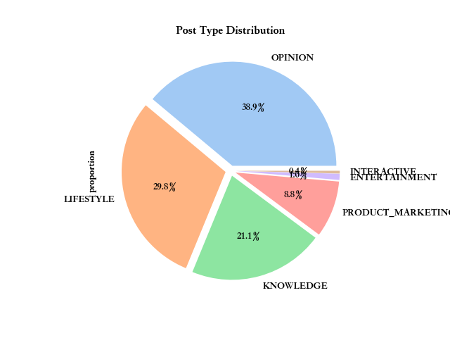
与上面观察形成反差的如下图所示，娱乐类内容虽然占比少，但平均点赞量最高，明显高于其他类别，点赞量紧接其后的是生活类内容。

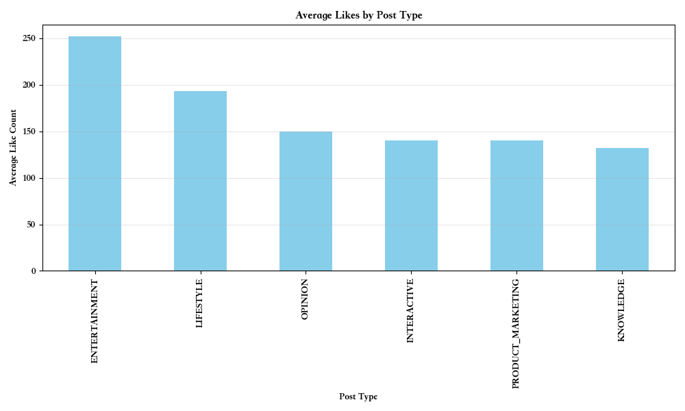

从上面两个数据分析可以得到一个显著的结论，在内容分享需要加入个人、生活化叙事，单纯的知识干活需要包装避免过于枯燥。

#### 热点内容
从下图看，70.89%的动态属于热点，29.11%为非热点，这是符合我们直觉的，高流量的动态是热点动态。但不那么符合直觉的是，热点动态和非热点动态的点赞数是差不多的，这可能说明点赞的行为更和动态质量、身份认同或者情感等其他因素相关和热点与否并不相关。
![[summary_pic/hotspot_distribution_content.png]]
![[summary_pic/hotspot_average_like_conent.png]]
从下图可以看出，对于动态的类型，对于热点动态来说，是意见类(49.7%)占比最高，其次是知识类(21.7%)，明显高于非热点动态中的意见类(15.5%)和知识类(14.2%)占比。对于非热点动态来说，生活类分享是占比最多的(57.8%)。**这告诉我们热点话题更容易引发观点讨论和知识分享，而非热点集中在日常分享上。反过来说，如果是做观点和知识的分享则需要追逐热点，而做日常生活的分享则可以岁月静好，不需要追逐热点**。
![[summary_pic/posttype_hotspot_content.png]]
从下图可以看出，热点动态中的负面情绪占比明显要比非热点动态中的负面情绪多。(19.4% VS. 5.0%)。这也许说明对于热点来说，对负面情绪更包容，因为从整体来看，积极情绪始终还是占主流。
![[summary_pic/sentiment_hotspot_content.png]]
#### 创意内容
创意内容指的是指具有独特性、新颖性、创新性的内容，是相对于常识来说有信息增量的内容或者表达方式新颖的内容。

从下图来看，创意内容只占比 38.5%，非创意内容占比 61.5%。在点赞数上，创意内容和非创意内容并没有差异。以上说明创意内容无论对于动态的曝光还是点赞影响都没有那么大，这稍微有点违反直觉，直觉是创意内容也许在社交媒体的传播中有优势。创意内容占比低的一个原因可能是创意生产者只占整个用户中少部分。
![[summary_pic/creative_distribution_content.png]]![[summary_pic/like_num_creative_content.png]]
此外，有三个观察颇有意思：
1. 在创意内容中，产品营销的内容要明显高于非创意内容中产品营销内容(12.7% VS. 7.3%)
2. 在创意内容中，娱乐类的内容要明显高于非创意内容中娱乐类内容（2.8% VS. 0.6%）
3. 创意内容中表达的积极情感明显高于非创意内容（79.8% VS. 63.8%）
![[summary_pic/posttype_creative_content.png]]
![[summary_pic/sentiment_creative_content.png]]
这些观察说明创意内容有通过资本赋能，以广告的方式展现出来；段子手还是需要点创造力的；在创意表达的过程中，更容易与积极情感结构，可能是为了让人产生良好的体验以购买产品。

#### 内容的情感偏向
如下图所示，积极情感在所有内容中占据主流（73%），但令人意外的是消极情感的平均点赞率明显高于其他类别（192）。**这说明即刻社区在鼓励积极向上的内容，这符合科技社区的共性，但消极的情感暴露更能引起人们的共鸣。这也指引着我们在内容创作的过程中需要投入情感，中立的干货难以打动人心**。
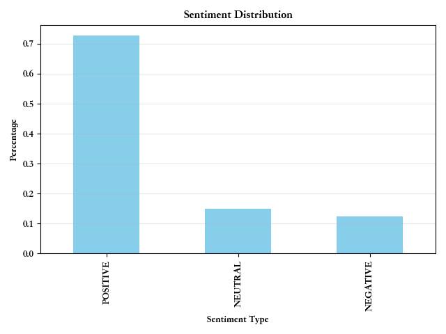
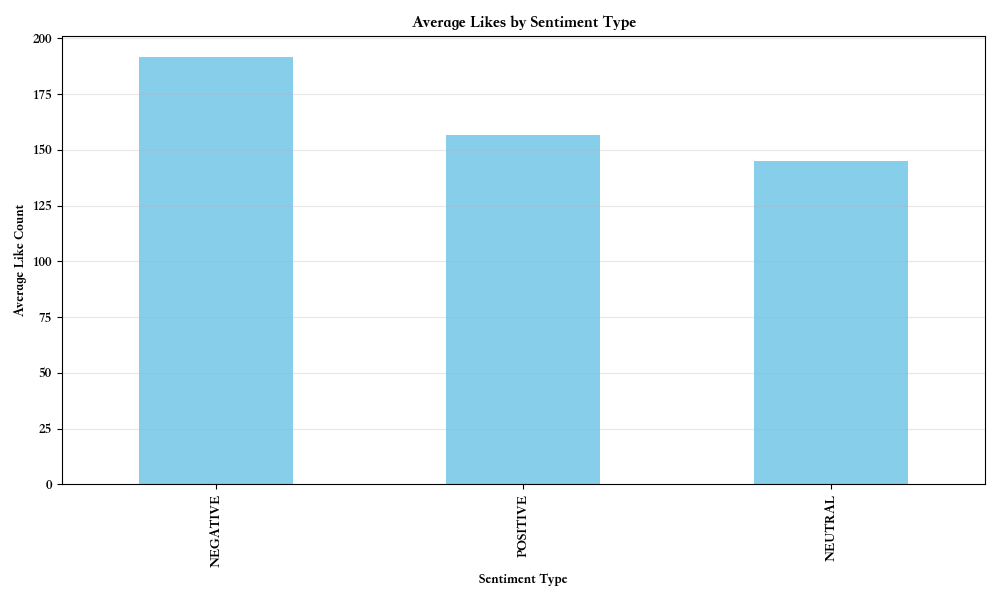

#### 内容长度
如下图所示，中长内容（中：100 到 500 字，长：500 到 2000 字）为主流（84.2%）

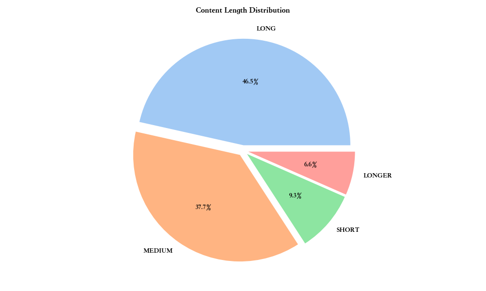
各内容长度的平均点赞率，如下图所示，整体差距不大，中等长度内容表现最差。
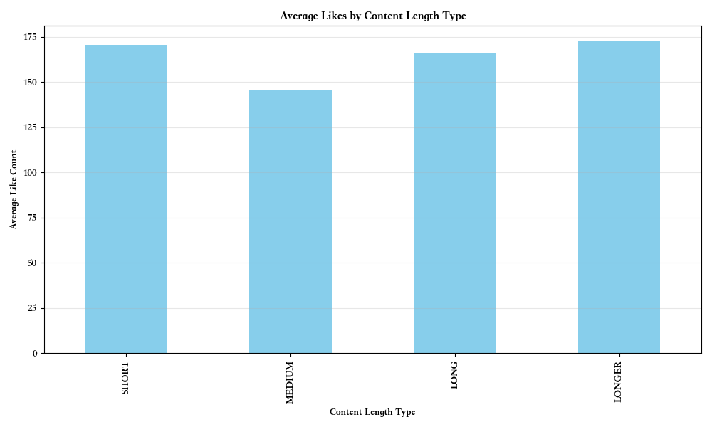

各内容长度下，情感分布如下图所示，整体的情感趋势并没有因为长度的不同而发生太多变化，依然是以积极情感为主。
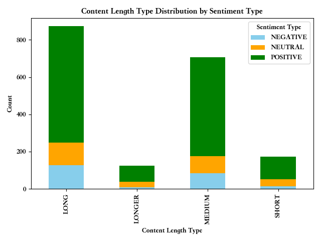
各内容长度下，文章类型的分布如下图所示：在长和超长内容长度下，观点类占比明显最高，高于生活类；但在中长度下，观点类和生活类平分秋色；在短长度下，生活类占比最高，明显高于其他类别。

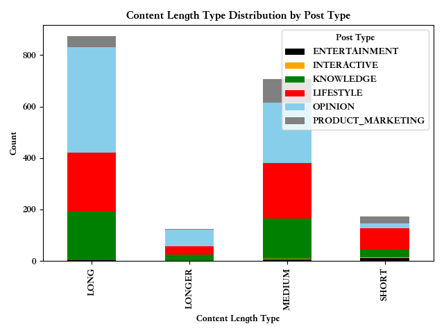

综上，长度也许并不重要，重要的是价值密度：”信息密度“或”情感密度“

### 结论
- **主题：偏爱个人成长（效率提升、职业发展、创业）和科技内容（AI）**
- **热点：如果是观点类或知识类的分享，尽量追热点，但如果是生活类的分享，则不用追热点**
- **创意：不用注重内容的独特性和创意，这不是社交媒体的核心**
- **内容类型：以生活方式分享和观点表达为主流，生活分享最收好评**
- **情感偏向：以积极的内容为主，尽管消极的内容能得到更多的赞**
- **内容长度：以 100 字到 1000 字内容最为常见，但小于 100 字或大于 1000 字的动态平均点赞数反而更多**

针对运营账号的建议：
- **精准定位，深耕主题:** 明确你的账号定位，是专注 AI 工具，还是个人成长方法论，或是职场经验分享。围绕核心主题持续输出高质量内容。参考热门标签和圈子，找到你的目标受众聚集地。
- **融入个人叙事** ：生活类或意见类内容最受欢迎，即使是分享干货，也要融入个人经验、故事。把一切当成将故事。
- **内容注入情感:** 主打积极内容，传递价值和正能量。适时、真诚地分享负面经历或反思（如遇到的困难、踩过的坑），可能带来意想不到的高互动。给内容注入情感，避免过于中立干货。
- **优化内容长度策略:** 尝试用精悍的短内容抓住碎片化注意力，也敢于创作超长深度内容建立专业壁垒。对于中长内容，确保信息密度和阅读体验。
- **紧跟热点** 关注平台和行业动态，思考结合点。不用担心自己的表达不具备创意和独特性，这对于社交媒体来说不是核心。

## 结论
### 即刻特有的属性或原则
- 即刻的用户具有”高知“、”年轻“和”科技导向“的特征，科技与生活是即刻的两大面。个人成长（效率提升、职业发展、创业）和科技（AI）的主题收欢迎。
- 技术类、自我管理类圈子天然乐观，乐观率超 80%；职场类、日记类圈子负能量较高
- 情绪表达要积极但真实：正能量为主，但也可以适度输出真实、引发共鸣的负面情绪（不抱怨、不鸡汤）
- 圈子的”场景隔离“意识：在工作/学习场景拒绝生活化内容
- 在即刻中长内容（100到2000字）占主导
- 上即刻镇小报的以大 v 为主，新人上精选的概率只有 2%
- 即刻存在着大量内容质量不输大V 的新人
- 粉丝量 1K, 10K 是影响力跃升的关键节点
- 新人文章长度控制在 200 到 500 字是最有性价比的，当粉丝量上千以后发布的长内容更容易被阅读
- 内容类型：以生活方式分享和观点表达为主流，生活分享最收好评

### 广泛适用于其他社交媒体的属性或原则
广泛适用的原则：
- 流量高的内容主要由头部创作者创作
- 热点圈子虽然流量大，但竞争强，素人初期在热点圈子里起号反而不容易
- 超高赞来源于审美驱动和身份认同
- 新人最好可以从1-2个擅长话题切入，当粉丝数上千以后跨领域创作是继续涨粉的关键
- 热点：如果是观点类或知识类的分享，尽量追热点，但如果是生活类的分享，则不用追热点
- 创意：不用注重内容的独特性和创意，这不是社交媒体的核心

起号建议：
- 先聚焦在有身份认同，稍小众或垂直的圈子里，用 100 到 2000 字创作带有实质价值的内容，深耕主题
- 初期专注 + 后期扩展： 小V可以从1-2个擅长话题切入，稳定后逐步拓展内容覆盖范围
- 观点输出带来高价值关注：想要成为大V，需要提升内容的“思辨性”和“表达立场”的能力
- 融入个人叙事：生活类或意见类内容最受欢迎，即使是分享干货，也要融入个人经验、故事。把一切当成将故事
- 内容注入情感: 主打积极内容，传递价值和正能量。适时、真诚地分享负面经历或反思（如遇到的困难、踩过的坑），可能带来意想不到的高互动。给内容注入情感，避免过于中立干货
- 紧跟热点：关注平台和行业动态，思考结合点。不用担心自己的表达不具备创意和独特性，这对于社交媒体来说不是核心
