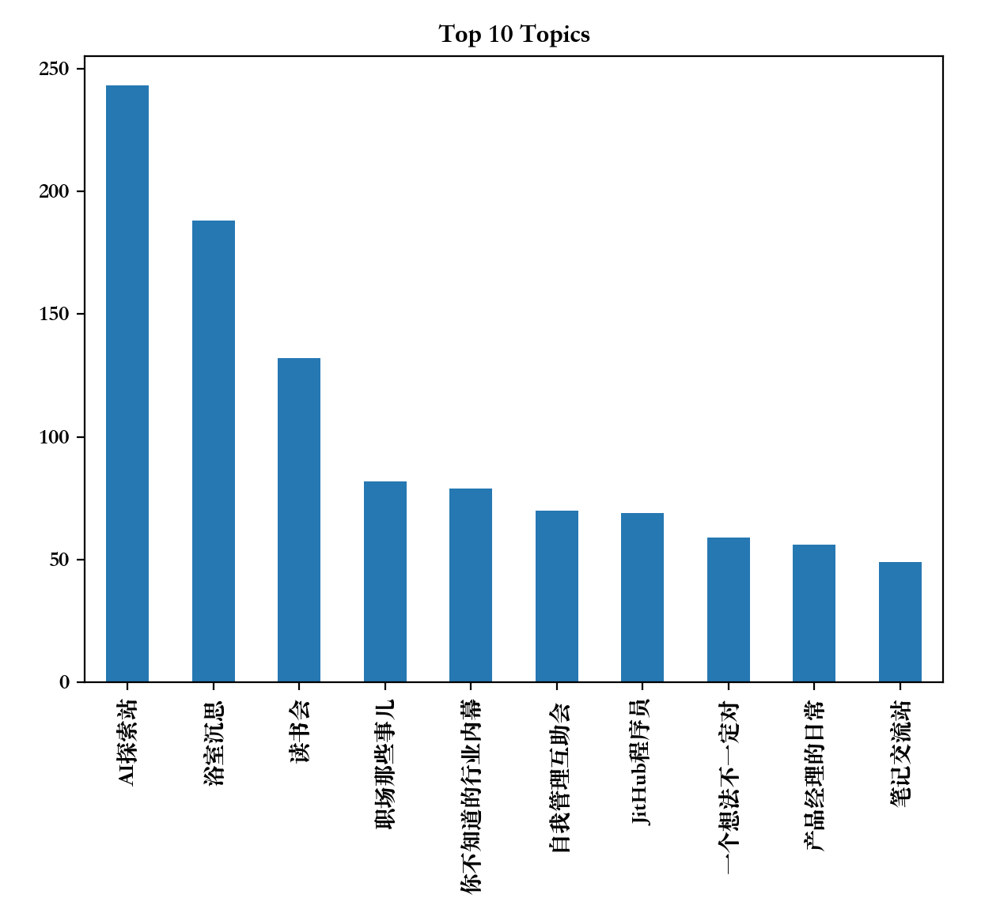
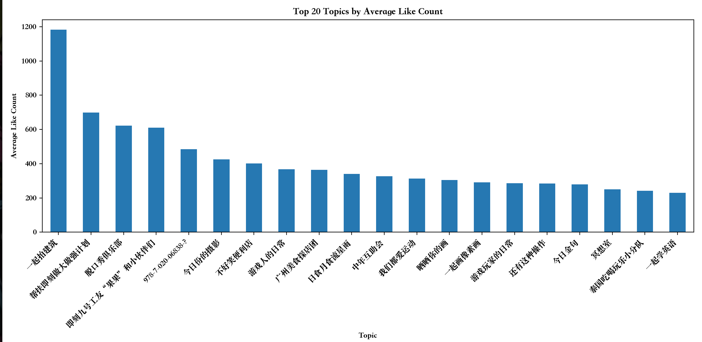
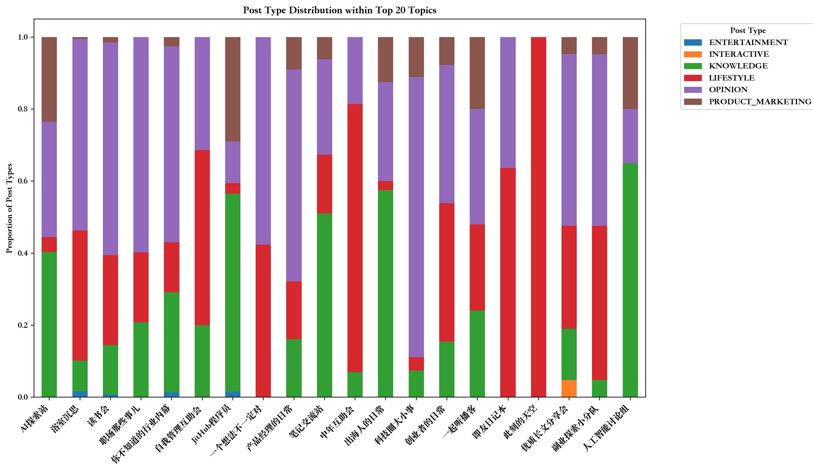
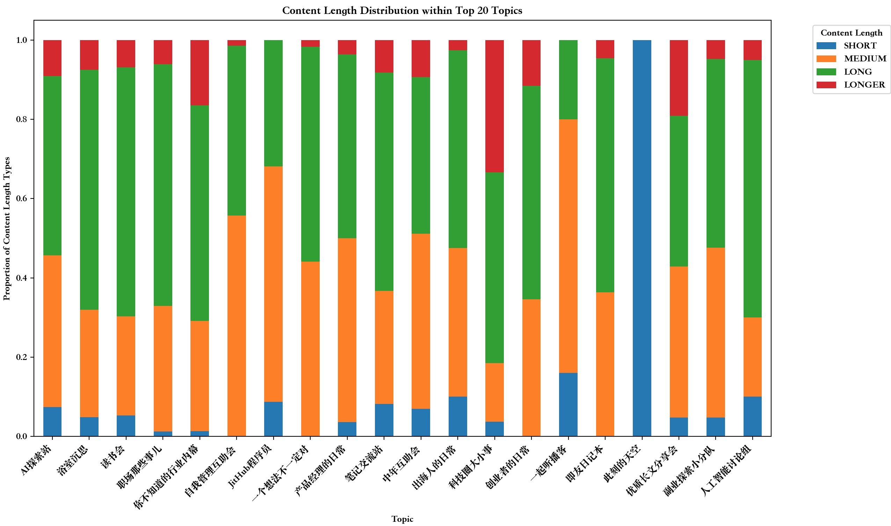
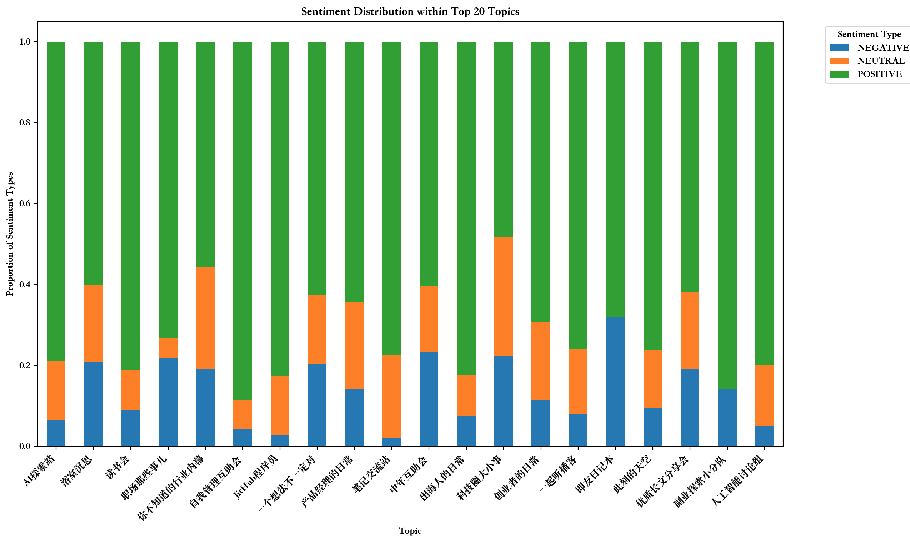

# 即刻创作者指北——AI破译1880篇即刻精选的"玄学"规律（1）：圈子

即友们咱都知道上精选的好处，动态能一下多出很多曝光和赞，带来大量粉丝，对于即刻小虾米来说，上精选就是混即刻的高光时刻。本虾米利用 AI 大模型，收集了最近一年多的即刻镇小报 1880 篇，从圈子、作者、文本类型、内容、文章长度、文本情感等角度探寻其中的”玄学“规律，希望这一系列的文章能帮助大家能一起上精选！

话不多，本文聚焦于圈子的分析，先前置结论。上精选和起号建议：**先聚焦在有身份认同，稍小众或垂直的圈子里，用 100 到 2000 字创作积极表达的意见态度或知识内容，个人介绍带有 AI 和自我成长标签。**

即刻的用户具有”高知“、”年轻“和”科技导向“的特征，科技与生活是即刻的两大面，精选动态实用主义明显，需要带来实质价值的内容。即刻的圈子呈现了极强的两极分化情况，前三个圈子（AI探索站、浴室沉思、读书会）上精选的文章明显高于其他圈子，其中又以AI探索站以243篇文章高居榜首，远高于第二名的浴室沉思（188篇）（热门圈子数据见图一）。Web3（2篇）、元宇宙（虚拟与混合现实小组，5篇）等前沿话题表现平庸，**说明AI是当前科技领域的唯一超级热点。**

**热点圈子虽然流量大，但竞争强，素人初期在热点圈子里起号反而不容易**。垂直圈子例如（JitHub程序员、产品经理、职场那些事儿）流量虽稍小，但竞争没有那么强，反而由于其垂直性更容易初期起号，获得关注。在长尾圈子中摄影类（一起拍建筑、今日份的摄影）、体验类（广州美食探店团、泰国吃喝玩乐）、兴趣类（游戏人的日常、一起画像素画）、情感共鸣类（中年互助会、不好笑便利店）虽然流量很小，但有概率出爆款、获得超高赞，远高于三大热门圈子（AI探索站、浴室沉思、读书会），论证了超高赞来源于审美驱动和身份认同。

通过对多圈子主题分析，发现相同的主题常出现在不同的圈子，**AI 与个人成长贯穿大部分圈子是即刻平台的双主线**。从动态类型来看，观点类动态占大多数，在80%的圈子中占比超过30%，浴室沉思（53.2%）、读书会（59.1%）、职场那些事儿（59.8%）等头部圈子尤为突出。知识类动态在技术型圈子高度集中：AI探索站（40.3%）、JitHub程序员（55.1%）、人工智能讨论组（65%），娱乐类动态难上精选。生活类动态在中年互助会（74.4%）、即友日记本（63.6%）超高占比，但科技类圈子普遍低于5%，反映了严格的"场景隔离"意识：在工作/学习场景拒绝生活化内容。此外对于产品营销类动态，技术圈接受度高：JitHub程序员（29%）、AI探索站（23%）；人文圈极度排斥：浴室沉思（0.5%）、读书会（1.5%）。

从精选的文本长度来看，中长内容（100到2000字）占主导，中篇内容（100到500字）聚集在自我管理互助会、JitHub程序员圈子；长篇内容（500到2000字）聚集在AI探索站、人工智能讨论组、浴室沉思、读书会；超长篇内容(2000字以上)聚集在科技圈大小事（33.3%）、行业内幕（16.5%）、创业者日常（11.5%）。

从精选动态的情感分析来看，整个即刻呈现乐观的倾向，最积极：自我管理互助会（88.6%正向）vs 最消极：即友日记本（31.8%负向）。技术类圈子天然乐观，乐观率超 80%，职场类圈子负能量稍高，职场那些事儿(22%)、行业内幕(19%)。

